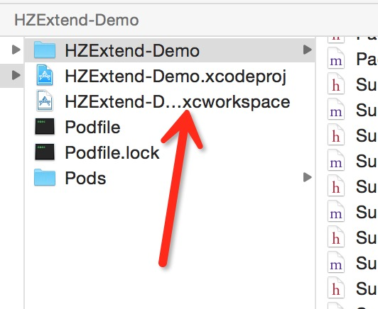

## HZExtend
#### 本项目交流群:32272635
#### 欢迎有兴趣的有好的想法的同学参与到项目中来，如果有问题请大家加入群中留言或者issue我，或者发邮件给我zuohong_xie@163.com

## 本项目特点
```bash
1.解放VC:基于MVVM的思想，将数据相关的业务逻辑交给到ViewModel处理从而减少控制器的压力，降低代码耦合.
2.网络请求:基于AFN自定义了贴切业务逻辑的网络请求框架.
3.缓存体系:基于TMCache定制与业务逻辑相符的缓存体系.
4.数据元组:基于FMDB自定于实现了与表元组对应的数据模型.
5.URLManager:根据URL进行页面的跳转导航
6.一些常用的基础类扩展.
```

## 使用
#### 添加
```ruby
CocoaPods:pod 'HZExtend', '~> 0.5.4'
```

#### 安装CocoaPodspod后可傻瓜式添加任何开源框架,免于一些基础配置
[CocoaPods的安装教程,群Q32272635我手把手教你安装](http://code4app.com/article/cocoapods-install-usage)

#### 没用过Pods同学注意了应该使用该文件来打开项目


## 其它资源
* [简书论坛](http://www.jianshu.com/collection/ba017346481d)


## 一.MVVM&网络请求
基本思路:网络请求基于HZSessionTask、HZNetwork(任务执行器)、HZNetworkConfig组成

#### 配置接口的共同URL、状态码路径,消息路径以及正确的状态码:
```objective-c
  [[HZNetworkConfig sharedConfig] setupBaseURL:@"http://v5.api.xxx" codeKeyPath:@"code" msgKeyPath:@"msg" userAgent:@"IOS" rightCode:0];
```
<br/>

#### 后台返回的数据无状态码路径(此时不会判断业务逻辑是否成功)
```objective-c
  [[HZNetworkConfig sharedConfig] setupBaseURL:@"http://v5.api.xxx" userAgent:@"IOS"];
```

#### 配置全局请求头
```objective-c
  [[HZNetworkConfig sharedConfig] addDefaultHeaderFields:@{@"key":@"value"}];
```

#### 网络状态
```objective-c
  [HZNetworkConfig sharedConfig].reachable  //程序刚启动时有0.02的网络状态延迟判断。故请求应在0.02s后再发出
```

#### HZSessionTask
```objective-c
  @interface FrameworkViewModel : HZViewModel
  
  @property(nonatomic, strong) HZSessionTask *task;
  
  @property(nonatomic, strong) HZUploadSessionTask *uploadTask;
  
  @property(nonatomic, strong) NSMutableArray *recArray;
  
  @end

  @implementation FrameworkViewModel
  - (void)loadViewModel //初始化ViewModel时调用,可以在这里对数据进行初始化
  {
      [super loadViewModel];
      
      //成为task的代理后，task会把请求状态事件回调给父类，父类从而回调taskDidFetchData,taskDidFail等回调方法
      _recTask = [HZSessionTask taskWithMethod:@"GET" path:@"/party/pooks-rank" params:[NSMutableDictionary dictionaryWithObjectsAndKeys:@1,kNetworkPage,MC_PAGE_SIZE,kNetworkPageSize, nil] delegate:self requestType:@"rank"];
      self.recTask.importCacheOnce = NO;  //默认为导入一次,但在分页模型中多次尝试导入缓存来使每次分页数据都能从缓存中读取
      self.recTask.pathkeys = @[kNetworkPage,kNetworkPageSize];   //设置后支持支持http://baseURL/path/value1/value2类型请求

      _recArray = [NSMutableArray arrayWithCapacity:UD_DEFAULT_PAGE_SIZE];
  }

  //请求任务请求成功，请求中取得缓存成功，无法连接取得缓存成功时调用，在这里设置数据模型，自定义时不需要调用父类的该方法
  - (void)taskDidFetchData:(HZSessionTask *)task type:(NSString *)type
  {
      if([type isEqualToString:@"rank"]) {
      [self.recArray appendPageArray:[task.responseObject objectForKeyPath:@"data.list"] pageNumber:task.page pageSize:task.pageSize];//追加分页数据  
      }
  }

  //请求失败，无法连接取得缓存失败时调用,在这里做一些失败处理，自定义时不需要调用父类的该方法
  - (void)taskDidFail:(HZSessionTask *)task type:(NSString *)type
  {
      [task minusPage];//将当前页减一
  }
  @end

  //VC
  @implementation DiscoverPookScene

  - (void)viewDidLoad
  {
      _viewModel = [MorePookViewModel viewModelWithDelegate:self];
      [self.viewModel sendTask:self.viewModel]; //发送请求
  }

  //viewModel的回调
  //task请求完成时调用,此时task的状态可能成功或失败
  - (void)viewModel:(HZViewModel *)viewModel taskDidCompleted:(HZSessionTask *)task type:(nullable NSString *)type
  {
      if (task.succeed) {
        [self.tableView reloadData];
      }else {
        [self showFailWithText:task.message yOffset:0];
      }
  }

  //task进入请求中调用,此时task的状态可能为请求中取得缓存成功,请求中取得缓存失败,请求中不尝试导入缓存,请求中取消请求
  - (void)viewModel:(HZViewModel *)viewModel taskSending:(HZSessionTask *)task type:(nullable NSString *)type
  {
      if (task.cacheSuccess) [self.tableView reloadData];
  }

  //task请求无法连接时调用此时task的状态可能为无法连接取得缓存成功,无法连接取得缓存失败,无法连接不尝试导入缓存
  - (void)viewModel:(HZViewModel *)viewModel taskDidLose:(HZSessionTask *)task type:(nullable NSString *)type
  {
      if (task.cacheSuccess) {
        [self.tableView reloadData];
      }
  }

  @end
```

## 二.数据模型
基本思路:模型的字段与表字段一一对应
#### 继承HZModel然后初始化以Friend为例:
```objective-c
  Friend *friend = [Friend modelWithDic:@"name":@"xzh3",@"age":@20,@"email":@"6540"];
```
#### 基本的数据库操作:
```objective-c
  [Friend open];  //任何数据库操作都应先打开数据库，然后再关闭
  [Friend close];
  [Friend excuteUpdate:@"insert into Friend(name,age) values(?,?)" withParams:@[@"xzh",@20]]; //除查询外的任何操作
  NSArray *select = [Friend excuteQuery:@"select *from Friend" withParams:nil];
  for (NSDictionary *f in select) {
  NSLog(@"%@---%@----%@",[f objectForKey:@"name"],[f objectForKey:@"age"],[f objectForKey:@"email"]);
  }
  NSInteger count = [Friend longForQuery:@"select count(*) from Friend"];   //查询整数型的数据如count
```
#### 元组数据操作:
```objective-c
  /***************************************增删改***************************************/
  [Friend safeSave];  //safe代表执行之前先open数据库，执行完毕后再close数据库
  [Friend safeDelete];
  ```
  ```objective-c
  /*****************************************查询(返回都是该模型)*****************************************/
  + (instancetype)modelWithSql:(NSString *)sql withParameters:(NSArray *)parameters;
  + (NSArray *)findByColumn:(NSString *)column value:(id)value;
  + (NSArray *)findWithSql:(NSString *)sql withParameters:(NSArray *)parameters;
  + (NSArray *)findAll;
  NSArray *select = [Friend findWithSql:@"select *from Friend" withParameters:nil];
  for (Friend *f in select) {
  NSLog(@"%@---%ld----%@",f.name,f.age,f.email);
  }
```

#### 数据库操作前后的回调，交由子类重写:
```objective-c
  - (void)loadModel;  //初始化配置(成员变量，或数组对象类设置)
  - (void)beforeSave;
  - (void)afterSave;
  - (void)beforeUpdateSelf;
  - (void)afterUpdateSelf;
  - (void)beforeDeleteSelf;
  - (void)afterDeleteSelf;
```
## 三.URLManager
基本思路:由`UIViewController+HZURLManager`(将URL转化成控制器),`HZURLNavigation`(跳转),`HZURLManageConfig`(参数配置),`HZURLManager`(结合创建和跳转,推荐直接使用这个类)

#### 参数配置
```objective-c
  //URL:类名
  [HZURLManageConfig sharedConfig].config = @{
  @"hz://Subject":@"SubjectViewController",
  @"hz://Home":@"HomeViewController"
  };

  //遇到http或者https时应创建的控制器,不写默认为HZWebViewController                                       
  [HZURLManageConfig sharedConfig].classOfWebViewCtrl = @"HZWebViewController";
```

#### HZURLManager
```objective-c
  /***************************************push***************************************/
  [HZURLManager pushViewControllerWithString:@"hz://Subject?k=v" animated:YES];
  //最后通过控制器的queryDic属性获取@{@“k”:@"v",@"key":@"value"}
  [HZURLManager pushViewControllerWithString:@"hz://Subject" queryDic:@{@"key":@"value"} animated:YES];

  /***************************************present***************************************/
  [HZURLManager presentViewControllerWithString:@"hz://Home?k=v" queryDic:@{@"key":@"value"} animated:YES completion:nil];
  [HZURLManager presentViewControllerWithString:@"hz://Home" animated:YES completion:nil];

  /***************************************Dismiss***************************************/
  [HZURLManager dismissCurrentAnimated:YES];
```
## 四.控制器
#### HZNavigationController
自定义侧滑手势,可以从任意位置触发侧滑,而自带的侧滑只能在边缘位置触发.
```objective-c
  /**
  *  是否开启侧滑
  */
  @property(nonatomic, assign) BOOL swipeEnable;

  /**
  *  当子控制器的数量<=改值时不触发侧滑手势,默认为1
  */
  @property(nonatomic, assign) NSUInteger countOfNoPanChild;
```
#### HZViewController
框架的模板控制器,推荐继承该控制器
```objective-c
  /**
  *  若导航控制器类型为HZNavigationController则返回,否则返回nil
  */
  @property(nonatomic, strong, readonly) HZNavigationController *nav;
```
#### HZWebViewController
框架的默认网页控制器,加载网页时推荐加载该控制器
```objective-c
  //初始化
  - (instancetype)initWithURL:(NSURL *)URL;

  //获取内部的UIWebView
  @property(nonatomic, strong, readonly) UIWebView *webView;

  /***************************************加载状态的回调***************************************/
  //可以重写来自定义处理方式
  -(void)webViewIsloading;    //加载中调用
  -(void)webViewIsSuccess;    //加载成功调用
  -(void)webViewIsFail;       //加载失败调用
```

## 五.HUD提示
基本思路:1.添加到vc.view上,通过创建时key可以获得  2.添加到window.view上
#### vc.view类型
```objective-c
  /***************************************请求场景***************************************/
  等待:[self showIndicatorWithText:@"请求中" forKey:@"request"];      
  请求成功:[self successWithText:@"请求成功" forKey:@"request"];
  请求失败:[self failWithText:@"请求失败" forKey:@"request"];

  /***************************************提示场景***************************************/
  [self showSuccessWithText:@"成功"];    //成功时使用
  [self showFailWithText:@"失败"];       //失败时使用
  [self showMessage:@"只显示文字"];      //仅需要文字提示时使用
```
#### window.view类型
```objective-c
  /***************************************请求场景***************************************/
  [self showWindowIndicatorWithText:@"请求中"];   //等待时使用
  [self successWithText:@"请求成功"];             //请求成功时使用
  [self failWithText:@"请求失败"];                //请求失败时使用

  /***************************************提示场景***************************************/
  成功:[self showWindowSuccessWithText:@"成功"];
  失败:[self showWindowFailWithText:@"失败"];
  仅文字:[self showWindowMessage:@"只显示文字"];
```
## 六.扩展类
#### HZSystem.h
```objective-c
  /***************************************判断系统版本***************************************/
  + (BOOL)isIOS6Later;    //包括IOS6,下同
  + (BOOL)isIOS7Later;
  + (BOOL)isIOS8Later;
  + (BOOL)isIOS9Later;
  + (BOOL)isIOS10Later;

  + (BOOL)isIOS6Early;    //不包括IOS6,下同
  + (BOOL)isIOS7Early;
  + (BOOL)isIOS8Early;
  + (BOOL)isIOS9Early;
  + (BOOL)isIOS10Early;

  /***************************************判断手机尺寸***************************************/
  + (BOOL)isIPhone35Inch;
  + (BOOL)isIPhone4Inch;
  + (BOOL)isIPhone47Inch;
  + (BOOL)isIPhone55Inch;
  + (BOOL)isIPhone4InchEarly; //include

  /***************************************手机型号信息***************************************/
  + (NSString *)platform;
```
#### UIView+HZExtend.h
```objective-c
  /***************************************快捷设置Frame***************************************/
  //左上角长为100的正方形
  UIView *view = [[UIView alloc] initWithFrame:CGRectZero];
  view.left = view.top = 0;
  view.width = view.height = 100;
  view.backgroundColor = [UIColor colorForHex:0x000000 alpha:0.5];
  [self.view addSubview:view];

  //居中长为100的正方形
  UIView *view = [[UIView alloc] initWithFrame:CGRectZero];
  view.width = view.height = 100;
  //view.centerX = (self.view.width-view.width)/2;
  //view.centerY = (self.view.height - view.height)/2;
  view.backgroundColor = [UIColor colorForHex:0x000000 alpha:0.5];
  [self.view addSubview:view];
  [view alignCenter]; //必须有父视图后才可以设置

  //alphaBlackView在brownView右边5个像素 
  UIView *brownView = [[UIView alloc] initWithFrame:CGRectMake(10, 200, 100, 100)];
  brownView.backgroundColor = [UIColor brownColor];
  [self.view addSubview:brownView];

  UIView *alphaBlackView = [[UIView alloc] initWithFrame:CGRectZero];
  alphaBlackView.width = alphaBlackView.height = 100;
  alphaBlackView.top = brownView.top;
  alphaBlackView.backgroundColor = [UIColor colorForHex:0x000000 alpha:0.5];
  [self.view addSubview:alphaBlackView];
  [alphaBlackView leftBehindView:brownView offset:5]; //必须在同一个视图层次结构后才可以参照brownView


  //其它更快捷的方法详见UIView+HZExtend.h
```

#### UIImageView+HZExtend.h
```objective-c
  /***************************************快捷设置图片***************************************/
  /*
  1.无url则直接设置为image
  2.老图片:若本地已经有图片，则直接从本地加载.
  3.新图片:设置占位，从远处加载
  */
  - (void)safeSetImageWithURL:(NSString *)url placeholder:(UIImage *)image;
```
#### UIColor+HZExtend.h
```objective-c
/***************************************快捷设置颜色***************************************/
  UIColor *whiteColor = [UIColor colorForHex:0xFFFFFF];
  UIColor *alphaBlackColor = [UIColor colorForHex:0x000000 alpha:0.5];

  UIColor *whiteColor = RGB(255,255,255);
  UIColor *alphaBlackColor = RGBA(0,0,0,0.5);
```

#### NSArray+HZExtend.h
```objective-c
  //若越界则返回nil
  - (id)objectAtSafeIndex:(NSInteger)index;
```

#### NSDictionary+HZExtend.h
```objective-c
  /**
  *  @{ @“person”:@{@"name":@"GeniusBrotherHZExtend"}}
  *  keyPath = @"person.name" 返回@“GeniusBrotherHZExtend”;
  */
  - (id)objectForKeyPath:(NSString *)keyPath;

  /**
  *  不存在,则返回other
  */
  - (id)objectForKeyPath:(NSString *)path  otherwise:(NSObject *)other;
```

#### NSMutableArray+HZExtend.h
```objective-c
  /**
  *  若下标越界时,则什么也不做
  */
  - (void)safeRemoveObjectAtIndex:(NSInteger)index;

  /**
  *	追加分页数据,若currentPageNumber=1,则receiver的元素跟pageArray元素相同,否则都追加到后面。不会追加重复的缓存数据
  *
  *	@param pageArray  需要追加的分页数据
  *  @param currentPageNumber 当前页数
  *  @param pageSize 每页数据的数量
  */
  - (void)appendPageArray:(NSArray *)pageArray pageNumber:(NSInteger)currentPageNumber pageSize:(NSInteger)pageSize;

```

#### NSString+HZExtend.h
```objective-c
  /**
  *  以md5算法加密
  */
  - (NSString *)md5;

  /************查询字符串************/
  - (NSString *)urlEncode;    //url编码
  - (NSString *)urlDecode;    //url解码
  /**
  *  以https://github.com/GeniusBrother/HZExtend?author=GeniusBrother为例
  */
  - (NSString *)scheme;   //https
  - (NSString *)host; //github.com
  - (NSString *)allPath;  //https://github.com/GeniusBrother/HZExtend
  - (NSString *)path; ///GeniusBrother/HZExtend
  - (NSString *)keyValues;    //author=GeniusBrother
  - (NSDictionary *)queryDic; //@{@"author":@"GeniusBrother"}
```
